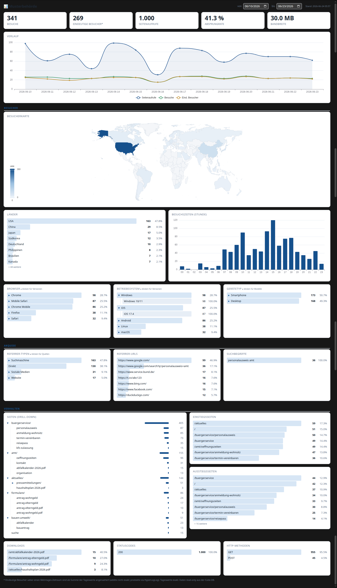

# Paket B - TYPO3-Reporting-Extension `sight_metrics`

Das **TYPO3-v13-Backend-Modul „Logauswertung"**. Es liest die vorberechneten
Auswertungsdaten (den „Cube") aus der MariaDB und stellt sie als interaktives
Dashboard dar - Diagramme, Barlisten mit Drill-down, Weltkarte und Seitenbaum.

Diese Extension ist der **Lese-Teil** von SightMetrics. Sie enthält **kein**
DuckDB und schreibt **nichts** in die Datenbank: Sie greift ausschließlich
**read-only** (DB-User `report_ro`, nur `SELECT`) auf den Cube zu, den
[Paket A (`ingestion/`)](../ingestion/README.md) befüllt. → Gesamtüberblick:
[Repo-README](../README.md).



---

## Was das Modul zeigt

- **KPI-Leiste:** Besuche, eindeutige Besucher, Seitenaufrufe, Absprungrate, Bandbreite
- **Verlauf** über die Zeit (Seitenaufrufe / Besuche / eindeutige Besucher)
- **Besucherkarte** (Choropleth-Weltkarte) und **Länder**-Liste
- **Besuchszeiten** nach Stunde
- **Browser / Betriebssystem / Gerätetyp** mit **Drill-down** in Versionen bzw. Modelle
- **Akquise:** Referrer-Typen, Referrer-URLs, Suchbegriffe
- **Verhalten:** Seitenbaum-Drill-down, Ein-/Ausstiegsseiten
- **Downloads, Statuscodes, HTTP-Methoden**
- **Zeitraum-Auswahl** (Matomo-artiges Dropdown: relativ / Kalender / einzelne Jahre /
  benutzerdefiniert), **Perioden-Vergleich**, **CSV-/PDF-Export**, **Dark Mode**
- **Site-Auswahl** bei Multi-Site-Betrieb

> Hinweis im Screenshot-Footer: Eindeutige Besucher über einen Mehrtages-Zeitraum
> sind als Summe der Tageswerte angenähert (additiv nicht exakt); Tageswerte sind
> exakt. Alle Daten kommen read-only aus dem Cube.

---

## Aufbau

```
extension/
├── README.md                  diese Datei
├── lint.sh                    Linting: PHPStan 2 + TYPO3 Coding Standards
├── run-tests.sh               Test-Runner (Unit / Functional / Smoke)
├── sync-to-demo.sh            Deploy ins Wegwerf-TYPO3 (demo/app/packages/sight_metrics/)
└── sight_metrics/             Composer-Paket  sightmetrics/sight-metrics
    ├── Classes/
    │   ├── Controller/        DashboardController  (baut das Modul-Payload)
    │   ├── Domain/Repository/ CubeRepository       (read-only SELECTs auf cube/daily/meta)
    │   ├── Support/           SiteSelector, WindowResolver (Zeitfenster), ErrorPage
    │   └── Command/           Health-/Smoke-Commands
    ├── Configuration/         Backend-Modul-Registrierung, Services, Icons
    ├── Resources/             Fluid-Templates, CSS, JavaScript, ECharts, Weltkarte
    ├── ext_conf_template.txt  Extension-Konfiguration (Fehlerseitentext, showTechnical, windowDays)
    └── Tests/                 Unit + Functional (SQLite)
```

---

## Installation & Konfiguration (Kurzfassung)

1. **Paket einbinden** - als Composer-Paket `sightmetrics/sight-metrics` (im Demo als
   path-Repository eingebunden).
2. **Cube-Connection** `cube` konfigurieren (Doctrine-Connection in `additional.php`),
   zeigend auf die Cube-DB mit dem **read-only**-User `report_ro`.
3. **TYPO3-Site → Cube-Site zuordnen** über `sightmetrics_site_id` in der
   Site-Konfiguration (siehe Multi-Site im Repo-README).
4. Modul im Backend unter **Web → „Logauswertung"** öffnen.

Die vollständige Anleitung - Installation, Connection, Site-Mapping, Fehlerseite,
Versionsmatrix, Architektur, Troubleshooting - steht im
**[Extension-Handbuch](../docs/extension-handbuch.md)**.

---

## Entwicklung

```bash
./lint.sh                 # PHPStan (Level 6) + TYPO3 Coding Standards
./run-tests.sh            # Unit-, Functional- (SQLite) und Smoke-Tests
./sync-to-demo.sh         # Extension ins laufende Wegwerf-TYPO3 deployen
```

Die Extension ist offen für **TYPO3 v13.4 LTS und v14**, PHP 8.2-8.4. Im Backend-Modul
kommt [Apache ECharts](https://echarts.apache.org/) für die Diagramme zum Einsatz.
