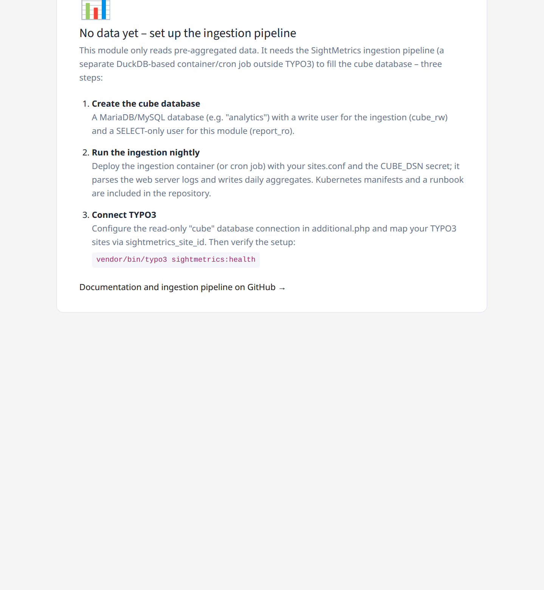

.. _installation:

============
Installation
============

Requirements
============

.. list-table::
   :header-rows: 1
   :widths: 30 70

   * - Component
     - Version
   * - PHP
     - ^8.2 (8.2–8.4 tested)
   * - TYPO3 CMS
     - ^13.4 or ^14.0
   * - MariaDB
     - >= 10.5 (cube database, reachable over the network; write user
       `cube_rw`, read user `report_ro`)
   * - Composer
     - v2

The extension contains **no** DuckDB and writes **nothing** to the cube
database. Writing is done exclusively by the separate ingestion pipeline
(package A).

Composer installation
======================

Until the package is published on Packagist, it can be included as a
composer path repository:

.. code-block:: json

   {
       "repositories": [
           {
               "type": "path",
               "url": "/opt/sightmetrics/extension/sight_metrics",
               "options": { "symlink": false }
           }
       ],
       "require": {
           "sightmetrics/sight-metrics": "*"
       }
   }

.. code-block:: bash

   composer require sightmetrics/sight-metrics
   vendor/bin/typo3 extension:activate sight_metrics

Configuring the cube database connection
==========================================

The extension expects a TYPO3 database connection named **`cube`** in
`$GLOBALS['TYPO3_CONF_VARS']['DB']['Connections']['cube']`.

Add this to `config/system/additional.php` of the TYPO3 instance:

.. code-block:: php

   // config/system/additional.php of the TYPO3 instance
   $GLOBALS['TYPO3_CONF_VARS']['DB']['Connections']['cube'] = [
       'driver'   => 'mysqli',
       'host'     => getenv('CUBE_RO_HOST') ?: 'db-host',
       'port'     => (int)(getenv('CUBE_RO_PORT') ?: 3306),
       'dbname'   => getenv('CUBE_RO_DB')   ?: 'analytics',
       'user'     => getenv('CUBE_RO_USER') ?: 'report_ro',
       'password' => getenv('CUBE_RO_PASSWORD'),   // never hard-code
       'charset'  => 'utf8mb4',
   ];

**Security note:** always read the password from an environment variable or a
secret file — never store it as plain text in `additional.php`. In containers,
inject it via `docker-compose.yml` or a Kubernetes secret.

Testing the connection
=======================

.. code-block:: bash

   vendor/bin/typo3 sightmetrics:smoke

This checks that the `cube` connection exists and that the tables `cube`,
`daily`, and `meta` are reachable.

Production hardening
=====================

The demo environment shipped with the project is deliberately permissive so
that the local Docker Compose stack works without fixed IPs/hostnames. The
following defaults must **not** be carried over unchanged into production:

- **`trustedHostsPattern`**: the demo sets
  `$GLOBALS['TYPO3_CONF_VARS']['SYS']['trustedHostsPattern'] = '.*'`
  (accepts any `Host` header — a host-header-injection risk). In production,
  always restrict this to the actual domain name, e.g.
  `'^(www\.)?my-domain\.example$'` (see the
  `TYPO3 documentation on trustedHostsPattern <https://docs.typo3.org/permalink/t3coreapi:trustedhostspattern>`__).
- **Database grant host for `report_ro`**: the demo creates the cube database
  user with `'report_ro'@'%'` (any host may connect as this user). In
  production, restrict the grant to the actual web subnet/host, e.g.
  `CREATE USER 'report_ro'@'10.0.1.0/255.255.255.0' ...` or, for a fixed IP,
  `'report_ro'@'10.0.1.42'`. Additionally secure the connection via network
  segmentation/firewalling — MySQL host grants alone are not a complete
  network safeguard.
- **Set up cache garbage collection**: the TYPO3 database table
  `cache_sight_metrics` grows unbounded without cleanup. Configure either the
  EXT:scheduler task "Caching framework garbage collection" (e.g. daily) with
  the `sight_metrics` cache selected, or a daily cron job running
  `DELETE FROM cache_sight_metrics WHERE expires < UNIX_TIMESTAMP();` directly
  against the TYPO3 database. See :ref:`known-problems` for details.

The cube connection is completely separate from the main TYPO3 database
connection — an outage of the cube database does not take down the TYPO3
backend.

Guided onboarding
=================

Until the cube database contains data, the backend module shows a guided
onboarding page with the three setup steps instead of an empty dashboard:

   The onboarding page shown while the cube database is still empty.
