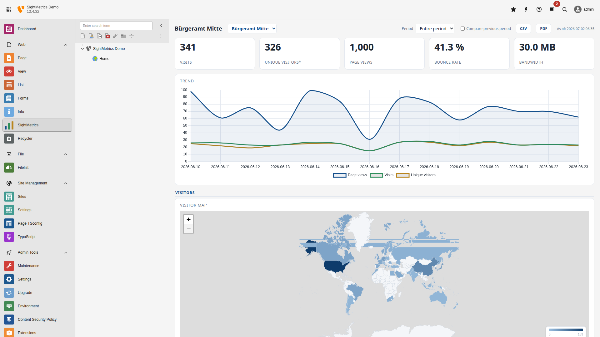

.. _introduction:

============
Introduction
============

What it does
============

SightMetrics evaluates web server logs instead of tracking every page view live via
a JavaScript snippet or tracking API (as tools like Matomo do). The raw log lines
are parsed, sessionized, and aggregated **once** with `DuckDB <https://duckdb.org/>`__
into compact daily aggregates ("cubes"). Only these aggregates are stored in a
database — no raw hits, no cookies, no client-side tracker.

This approach is deliberately data-sparse: no personally identifiable browsing
history is retained beyond the aggregated dimensions, which makes SightMetrics
well suited for organizations with strict GDPR/DSGVO requirements, such as public
administrations and the public sector.

Two-package architecture
=========================

SightMetrics consists of two independent packages that share no code, only a
database — a deliberate architectural boundary:

- **Package A – Ingestion** (not part of this extension): parses Apache/nginx
  access logs, sessionizes hits, and aggregates them with DuckDB into the cube
  database. It writes with a dedicated read-write database user (`cube_rw`).
  It is deployed separately, e.g. as a nightly disposable container or Kubernetes
  CronJob, and has no dependency on TYPO3.
- **Package B – This extension** (`sight_metrics`): a read-only TYPO3 backend
  module that queries the cube database with a dedicated read-only user
  (`report_ro`, `SELECT` only) and renders the dashboard. It contains no DuckDB
  and never writes to the cube database.

::

   Apache/nginx      Package A: Ingestion (DuckDB)            MariaDB          Package B: TYPO3 extension
   ─────────────     ────────────────────────────             ─────────        ──────────────────────────
   access.log   ───► parse → sessionize → aggregate     ───►  cube DB   ◄────  Backend module "Log analysis"
   (raw lines)        (load_cube.sh / transform.sql)          (cube/daily/meta) (reads only, renders charts)

Data model
==========

.. list-table::
   :header-rows: 1
   :widths: 20 80

   * - Term
     - Meaning
   * - **Cube**
     - Pre-aggregated analysis data in MariaDB. Table `cube(site_id, datum, dim,
       dimkey, pv, v)`: pageviews (`pv`) and visits (`v`) per day, per dimension,
       per value.
   * - **Dimension (`dim`)**
     - Analysis axis, e.g. `url`, `country`, `browser`, `os`, `device`,
       `referrer_type`, `keyword`, `hour`, `entry`/`exit`, `download`, `status`,
       `method`.
   * - **`daily` / `meta`**
     - Daily key figures (visits, pageviews, unique visitors, bounces, bytes)
       and overall metadata per site, respectively.
   * - **Sessionization**
     - Grouping of individual hits into visits based on IP + user agent and a
       30-minute inactivity window — happens in DuckDB, not in the database.
   * - **Site / `site_id`**
     - An analyzed website. Multiple sites are stored with different `site_id`
       values in **one** cube database (multi-site).

Dashboard features
===================

   The backend module: KPI bar, trend chart and visitor world map.

- **Visits over time** chart, **world map** (choropleth), and country list
- **Visiting hours** (hourly heatmap), **browser / operating system / device**
  with **drill-down** (down to versions/models)
- **Referrer** types and URLs, **search keywords**
- **Entry/exit pages**, **downloads**, **status codes**, **HTTP methods**,
  **page-tree drill-down**
- **KPIs** including bounce rate and bandwidth
- **Period selection** (a Matomo-like dropdown: relative / calendar / individual
  years / custom), **period comparison**
- **CSV and PDF export**, **dark mode**
- **Bot/crawler filtering** (user-agent heuristic, can be disabled) — only human
  visitors are counted; status codes still include 4xx/5xx for error diagnosis

Bundled third-party libraries
==============================

The following JavaScript libraries are vendored (self-hosted, no CDN) under
`Resources/Public/Vendor/`:

- **Chart.js** 4.5.1 (MIT) — history chart and hourly chart
- **Leaflet** 1.9.4 (BSD-2-Clause) — visitor map
- **world.js** 1.1.1 — world map TopoJSON data derived from Natural Earth via
  `world-atlas`

These files are updated manually: download the corresponding release build and
replace the vendored file (see `scripts/update-vendor.mjs` and
`Resources/Public/Vendor/NOTICE.md` for versions and checksums). License texts
are tracked in `REUSE.toml` and `LICENSES/`.
