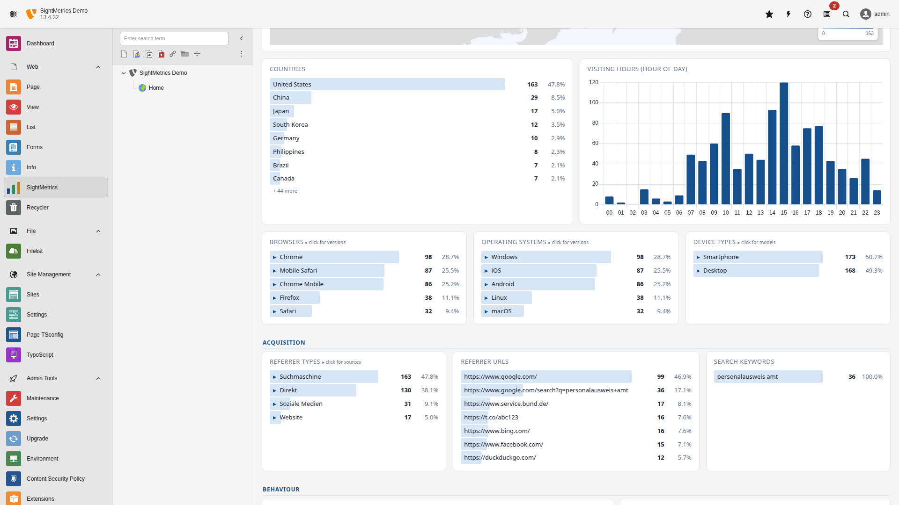
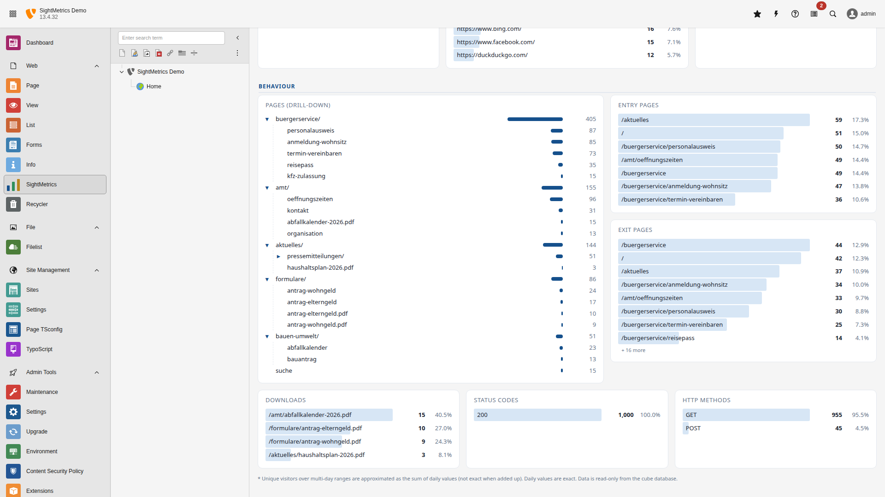

.. _usage:

=====
Usage
=====

The backend module is available under **Web → Log analysis** (`web_sightmetrics`).

Site selection
===============

If multiple sites are mapped, a dropdown appears. The selection is passed via
the URL parameter `site` and stored in the user's backend session.

Period selection
==================

A single **"Period"** dropdown (Matomo-like), rather than several separate
fields:

- **Relative:** Today, Yesterday, Last 7 / 30 / 90 days (anchored to the most
  recent available data, never into the future).
- **Calendar:** This/last month, this/last year.
- **Specific years:** one entry per year present in the data (e.g. "Year 2025").
- **Entire period** and **Custom…**.

Only when **"Custom…"** is selected do the `from`/`to` (ISO date) fields and a
month picker expand; otherwise they stay collapsed. The default entry reflects
the initially loaded state (see the server-side window below) and does not
trigger a reload.

**Server-side time window (scaling):** the entire cube is not loaded into the
frontend at once — only a window is loaded (default 92 days, configurable via
`windowDays`, `0` = unlimited). Selections **within** the window filter
immediately client-side (including comparisons); selections **outside** the
window trigger a server reload of the matching window (`?from=&to=`). This
keeps the transfer volume independent of the cube database's retention.

Dark mode
=========

The module follows the TYPO3 backend color scheme (`data-color-scheme`
attribute, falling back to `prefers-color-scheme`): cards, text, bar lists, and
the Chart.js axes/labels are recolored for readability in dark mode. Switching
is applied client-side via the `sm-dark` class on the root container.

KPI bar
=======

Visits, pageviews, unique visitors, bounce rate, total bandwidth — always for
the selected period and site.

Period comparison
==================

A **"Compare to previous period"** checkbox in the toolbar. When enabled, the
selected period is compared against the **immediately preceding period of the
same length** (e.g. the 30 days before). Each KPI gets a delta badge (▲/▼ ± %),
color-coded by direction (green = better, red = worse; for bounce rate, "down"
is good). In the history chart, the previous period appears as a dashed
reference line (position-wise day-to-day). Note: if the previous period lies
fully or partially before the earliest available data (`meta.von`), the delta
stays empty — only fully available periods are compared (no distorted partial
comparisons). Consequently, when "Entire period" is selected, there is
naturally no previous period to compare against.

Export
======

Two buttons in the toolbar, both purely client-side (no server round-trip,
CSP-compliant):

- **CSV** – downloads the current period as CSV (UTF-8 with BOM, `;`-separated,
  Excel-compatible): a header (site/period/data status), the daily history,
  and all dimension breakdowns (country, browser, OS, device, referrer, search
  keywords, pages, entry/exit, downloads, status, method, hour). File name:
  `sightmetrics_<site>_<from>_<to>.csv`.
- **PDF** – opens the browser's print dialog ("Save as PDF"). A print
  stylesheet hides the toolbar and rearranges the panels for printing.

Analysis panels
================

   Visitor and acquisition panels with drill-down bar lists.

   Behaviour panels including the lazy-loaded page tree.

.. list-table::
   :header-rows: 1
   :widths: 40 60

   * - Panel
     - Dimension (`dim`)
   * - History chart
     - Daily aggregate (`daily` table)
   * - World map (choropleth)
     - `country`
   * - Country bar list
     - `country`
   * - Browsers
     - `browser`
   * - Operating systems
     - `os`
   * - Device types
     - `device`
   * - Referrer types
     - `referrer_type`
   * - Referrer URLs
     - `referrer`
   * - Search keywords
     - `keyword`
   * - Entry pages
     - `entry`
   * - Exit pages
     - `exit`
   * - Downloads
     - `download`
   * - Status codes
     - `status`
   * - HTTP methods
     - `method`
   * - Page tree
     - `url` (with drill-down)
   * - Visiting hours
     - `hour`

Semantics notes:

- **Status codes** also include 4xx/5xx (for error diagnosis); `v` there is
  the number of *affected visitors*, not visits. All other panels count only
  successful requests (status < 400).
- **Bots/crawlers** are already filtered out during ingestion via a
  user-agent heuristic (`SM_BOT_FILTER`).
- **Visiting hours** are reported in the ingestion time zone `SM_TZ` (default
  UTC; set `SM_TZ=Europe/Berlin` for installations that need local time).
- A day only appears **after it has completed** (day-boundary cut of the
  incremental import) — on a nightly run, this means the previous day.

Drill-down
==========

Clicking a bar-list row opens a sub-level (e.g. browser → versions, OS →
versions, page tree → sub-pages). Keyboard-operable via Enter/Space, ARIA
compliant (WCAG 2.1 AA).

Health check CLI command
==========================

To monitor whether the ingestion pipeline is still running (freshness
monitoring), run this from the long-running TYPO3 instance — not from the
disposable ingestion container:

.. code-block:: bash

   vendor/bin/typo3 sightmetrics:health --warn-hours=26 --crit-hours=50 --json

Exit codes follow the Nagios convention: `0` = OK, `1` = WARNING, `2` =
CRITICAL, `3` = UNKNOWN. Schedule it via the TYPO3 scheduler or external
monitoring (e.g. an uptime check).
